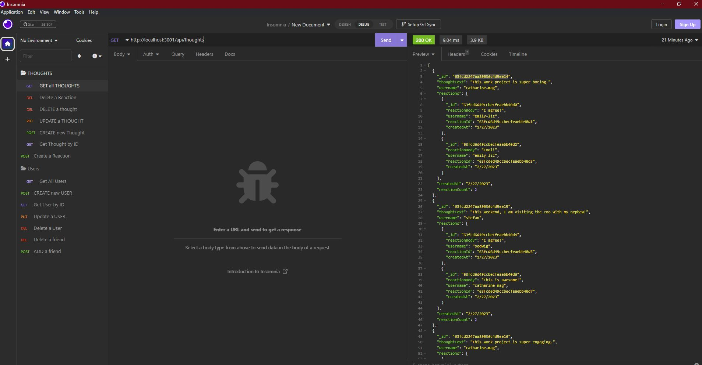

# SocialNet-API

## Description

This is an API template for a social web app where users can share their thoughts, react to friends' thoughts, and create a friends list. It uses Express.js for routing, a MongoDB database, and the Mongoose ODM.

## Table of Contents

- [Installation](#installation)
- [Usage](#usage)
- [Credits](#credits)
- [License](#license)
- [Contributing](#contributing)
- [Tests](#tests)

## Installation

To install the application locally, ensure that [Node.js](https://nodejs.org/en/download/) and [MongoDB](https://www.mongodb.com/docs/manual/administration/install-community/) installed, then clone the repository from Github and run the installation script `npm run install` followed by the start script `npm run start`. Ignore the seeding functionality as that component is still in progress.

## Usage

To explore the API, use a REST client such as [Insomnia](https://insomnia.rest/) or to view, create, update and delete (CRUD) routes. Check out this [walkthrough video](https://drive.google.com/file/d/1n4kMUS5w9XXwV7wZ008hdTlAYV0_BRqK/view) for reference.

## Credits

Collaborators: Sha Chambers

## License

This application is covered under the MIT license.

## Contributing

[Contributor Covenant](https://www.contributor-covenant.org/version/2/1/code_of_conduct/)

## Tests

N/A
